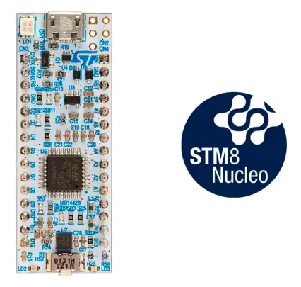

# STM8S207 Nucleo-32 Development Board

Under here I will be exploring the STM8S207 development boards and what I can do with them.

[STM8 Nucleo-32 development bard with STM8S207K8 MCU](https://www.st.com/en/evaluation-tools/nucleo-8s207k8.html)

[User Guide](um2391-stm8-nucleo32-board-mb1442-stmicroelectronics.pdf)